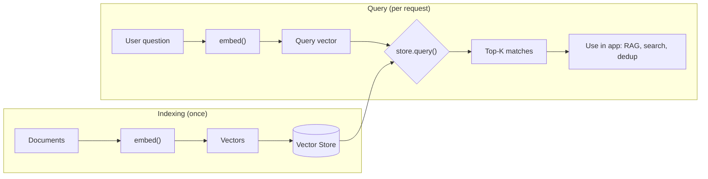

# WebFiori AI

A provider-agnostic AI library for PHP. Supports chat completions, embeddings, image generation, tool calling, and streaming across multiple providers (OpenAI, Google, Anthropic, AWS Bedrock).

<p align="center">
  <a href="https://github.com/WebFiori/ai/actions">
    
  </a>
  <a href="https://codecov.io/gh/WebFiori/ai">
    
  </a>
  <a href="https://sonarcloud.io/dashboard?id=WebFiori_ai">
      
  </a>
  <a href="https://github.com/WebFiori/ai/releases">
      
  </a>
  <a href="https://packagist.org/packages/webfiori/ai">
      
  </a>
</p>

## Key Features

- **Provider-Agnostic** — Common interface across OpenAI, Google, Anthropic, and AWS Bedrock
- **Chat Completions** — Send messages and receive AI-generated responses
- **Streaming** — Token-by-token streaming via Server-Sent Events
- **Embeddings** — Generate vector embeddings for semantic search
- **Image Generation** — Generate images from text prompts
- **Tool/Function Calling** — Define tools the AI can invoke during conversation
- **Conversation Management** — Built-in conversation history with swappable storage
- **Provider Fallback** — Automatic failover with circuit breaker pattern for resilience
- **Enterprise Ready** — Retry logic, rate limiting, caching, health checks, metrics, audit logging
## Supported PHP Versions

|                                                                                        Build Status                                                                                         |
|:-------------------------------------------------------------------------------------------------------------------------------------------------------------------------------------------:|
| <a target="_blank" href="https://github.com/WebFiori/ai/actions/workflows/php81.yaml"></a> |
| <a target="_blank" href="https://github.com/WebFiori/ai/actions/workflows/php82.yaml"></a> |
| <a target="_blank" href="https://github.com/WebFiori/ai/actions/workflows/php83.yaml"></a> |
| <a target="_blank" href="https://github.com/WebFiori/ai/actions/workflows/php84.yaml"></a> |
| <a target="_blank" href="https://github.com/WebFiori/ai/actions/workflows/php85.yaml"></a> |

## Installation

```bash
composer require webfiori/ai
```

## Quick Start

```php
<?php

use WebFiori\Ai\Provider\OpenAI\OpenAIClient;
use WebFiori\Ai\Message;

$client = new OpenAIClient([
    'api_key' => 'sk-...',
    'model' => 'gpt-4o',
]);

$response = $client->chat([
    new Message('system', 'You are a helpful assistant.'),
    new Message('user', 'What is PHP?'),
]);

echo $response->getMessage()->getContent();
```

### Streaming

```php
$client->streamChat(
    messages: [
        new Message('user', 'Write a story about PHP'),
    ],
    onToken: function (string $token) {
        echo $token;
        flush();
    },
);
```

### Multiple Providers

```php
use WebFiori\Ai\Provider\Google\GoogleClient;

$client = new GoogleClient([
    'api_key' => 'your-gemini-api-key',
    'model' => 'gemini-2.5-flash',
]);

$response = $client->chat([
    new Message('user', 'What is PHP?'),
]);
```

### Embeddings

Generate vector embeddings for semantic search, clustering, or RAG. Supported by
OpenAI and Google (see the [provider comparison](#provider-comparison)).

The typical flow is: turn your documents into vectors once, store them, then at
query time embed the user's question and find the closest vectors.



```php
use WebFiori\Ai\Provider\OpenAI\OpenAIClient;
use WebFiori\Ai\Provider\OpenAI\OpenAIClientConfig;

$client = new OpenAIClient(new OpenAIClientConfig(
    apiKey: 'sk-...',
    model: 'gpt-4o',
));

// Embed one or many texts in a single call
$response = $client->embed(
    ['How do I reset my password?', 'Account recovery steps'],
    ['model' => 'text-embedding-3-small'],
);

echo 'Dimensions: '.$response->getDimensions().PHP_EOL;
$vectors = $response->getVectors(); // array of float[] vectors
```

Pair embeddings with the built-in vector store for semantic search:

```php
use WebFiori\Ai\Embedding\InMemoryVectorStore;

$store = new InMemoryVectorStore();
$store->store('doc-1', $vectors[0], ['text' => 'How do I reset my password?']);

$queryVector = $client->embed('forgot my login', ['model' => 'text-embedding-3-small'])->getVector();
$results = $store->query($queryVector, topK: 3);

foreach ($results as $record) {
    printf("[%.3f] %s\n", $record->getScore(), $record->getMetadata()['text']);
}
```

### Image Generation

Generate images from text prompts. Supported by OpenAI (DALL·E) and Google (Imagen).

```php
use WebFiori\Ai\ImageRequest;
use WebFiori\Ai\Provider\OpenAI\OpenAIClient;
use WebFiori\Ai\Provider\OpenAI\OpenAIClientConfig;

$client = new OpenAIClient(new OpenAIClientConfig(apiKey: 'sk-...'));

$request = new ImageRequest(
    prompt: 'A serene Japanese garden with a bridge over a koi pond, watercolor style',
    size: '1024x1024',
    quality: 'hd',
    style: 'natural',
);

$response = $client->generateImage($request);
$image = $response->getImages()[0];

echo 'URL: '.$image->getUrl().PHP_EOL;
```

### Provider Fallback

```php
use WebFiori\Ai\Provider\Fallback\FallbackProvider;
use WebFiori\Ai\Provider\OpenAI\OpenAIClient;
use WebFiori\Ai\Provider\OpenAI\OpenAIClientConfig;
use WebFiori\Ai\Provider\Anthropic\AnthropicClient;
use WebFiori\Ai\Provider\Anthropic\AnthropicClientConfig;

// Automatic failover: tries OpenAI first, then Anthropic if OpenAI fails
$provider = new FallbackProvider([
    new OpenAIClient(new OpenAIClientConfig(apiKey: '...', model: 'gpt-4o')),
    new AnthropicClient(new AnthropicClientConfig(apiKey: '...', model: 'claude-sonnet-4-20250514')),
]);

$response = $provider->chat([new Message('user', 'Hello!')]);
```

### Interactions API (gemini-3.5-flash+)

```php
use WebFiori\Ai\Provider\Google\GoogleClient;
use WebFiori\Ai\Provider\Google\GoogleClientConfig;

// Interactions API is auto-detected for gemini-3.x models
$client = new GoogleClient(new GoogleClientConfig(
    model: 'gemini-3.5-flash',
    apiKey: 'your-api-key',
));

$response = $client->chat([new Message('user', 'What is PHP?')]);
echo $response->getMessage()->getContent();
echo 'Interaction ID: '.$response->getRequestId();
```

### Model Aliases

```php
use WebFiori\Ai\ModelAliases;

// Define once, use everywhere
$aliases = new ModelAliases([
    'fast'  => ['openai' => 'gpt-4o-mini', 'google' => 'gemini-2.5-flash'],
    'smart' => ['openai' => 'gpt-4o',      'google' => 'gemini-2.5-pro'],
]);

$client->setModelAliases($aliases);
$response = $client->chat($messages, ['model' => 'fast']);
// → 'gpt-4o-mini' for OpenAI, 'gemini-2.5-flash' for Google
```

### Model Router

```php
use WebFiori\Ai\Routing\ModelRouter;
use WebFiori\Ai\Routing\Strategy\TaskComplexityStrategy;

// Route automatically based on request complexity
$router = new ModelRouter(['fast' => $geminiFlash, 'smart' => $geminiPro]);
$router->setStrategy(new TaskComplexityStrategy('fast', 'smart'));

$response = $router->chat($messages);
// Simple → gemini-2.5-flash, complex → gemini-2.5-pro
```

### Tool with Image Output (ToolResponse)

```php
use WebFiori\Ai\ContentPart;
use WebFiori\Ai\Tool\Tool;
use WebFiori\Ai\Tool\ToolResponse;

// Tools can return images alongside text for visual analysis
$chartTool = new Tool(
    'generate_chart',
    'Generates a chart image',
    ['type' => 'object', 'properties' => ['title' => ['type' => 'string']]],
    function (array $args): ToolResponse {
        $imageData = generateChartPng($args['title']); // your image generation

        return ToolResponse::withImages(
            json_encode(['title' => $args['title'], 'status' => 'generated']),
            [ContentPart::imageBase64(base64_encode($imageData), 'image/png')]
        );
    }
);

// The model sees both the text metadata AND the image
$response = $client->chat(
    [new Message('user', 'Generate a Q3 revenue chart and describe it.')],
    ['tools' => [$chartTool], 'auto_execute_tools' => true]
);
```

## Provider Comparison

Feature support varies by provider. All providers share the same interface, so
switching is a config change — but the following operations are provider-specific:

| Feature                    | OpenAI | Google (Gemini/Vertex) | Anthropic | AWS Bedrock |
|----------------------------|:------:|:----------------------:|:---------:|:-----------:|
| Chat completions           |   ✅   |          ✅            |    ✅     |     ✅      |
| Streaming                  |   ✅   |          ✅            |    ✅     |     ✅      |
| Tool / function calling    |   ✅   |          ✅            |    ✅     |     ✅      |
| Structured output (JSON)   |   ✅   |          ✅            |    ✅     |     ✅      |
| Vision / multi-modal input |   ✅   |          ✅            |    ✅     |     ✅      |
| Embeddings                 |   ✅   |          ✅            |    ❌     |     ❌¹     |
| Image generation           |   ✅   |          ✅            |    ❌     |     ❌¹     |

Calling an unsupported operation throws `UnsupportedFeatureException` with a
message pointing to a provider that supports it.

¹ Not yet implemented for Bedrock. Anthropic has no embeddings or image-generation
API; use OpenAI or Google for those.

## Configuration Reference

Each provider has a typed config class extending `ClientConfig`. Common options
(`model`, `timeout`, `connectTimeout`) are shared; the rest are provider-specific.

### Common options (all providers)

| Option           | Type     | Default | Description                       |
|------------------|----------|---------|-----------------------------------|
| `model`          | `string` | *(provider default)* | Default model for chat completions. |
| `timeout`        | `int`    | `30`    | Request timeout in seconds.       |
| `connectTimeout` | `int`    | `10`    | Connection timeout in seconds.    |

### OpenAI — `OpenAIClientConfig`

| Option           | Type          | Default                      | Description                                  |
|------------------|---------------|------------------------------|----------------------------------------------|
| `apiKey`         | `string`      | *(required)*                 | OpenAI API key.                              |
| `model`          | `string`      | `gpt-4o`                     | Default chat model.                          |
| `organization`   | `?string`     | `null`                       | OpenAI organization ID.                      |
| `baseUrl`        | `string`      | `https://api.openai.com/v1`  | Override for Azure OpenAI / compatible APIs. |
| `embeddingModel` | `string`      | `text-embedding-3-small`     | Model used by `embed()`.                     |
| `imageModel`     | `string`      | `dall-e-3`                   | Model used by `generateImage()`.             |

### Google — `GoogleClientConfig`

Authentication priority: `apiKey` > `accessToken` > `credentials`.

| Option           | Type                        | Default                                       | Description                                        |
|------------------|-----------------------------|-----------------------------------------------|----------------------------------------------------|
| `model`          | `string`                    | `gemini-2.5-flash`                            | Default chat model.                                |
| `apiKey`         | `?string`                   | `null`                                        | Gemini API key from Google AI Studio.              |
| `projectId`      | `?string`                   | `null`                                        | GCP project ID (required for Vertex AI).           |
| `location`       | `string`                    | `global`                                      | GCP region, or `global` for automatic routing.     |
| `credentials`    | `string\|array\|null`       | `null`                                        | Service-account JSON path or array.                |
| `accessToken`    | `?string`                   | `null`                                        | Pre-fetched OAuth2 access token.                   |
| `api`            | `GoogleApi`                 | `GoogleApi::GEMINI`                           | `GEMINI` or `VERTEX` endpoint.                     |
| `apiVersion`     | `GoogleApiVersion`          | `AUTO`                                         | `AUTO` detects Interactions API for gemini-3.x.    |
| `embeddingModel` | `string`                    | `text-embedding-004`                          | Model used by `embed()`.                           |
| `imageModel`     | `string`                    | `gemini-2.5-flash-preview-image-generation`   | Model used by `generateImage()`.                   |
| `publisher`      | `string`                    | `google`                                      | Model Garden publisher (`anthropic`, `meta`, ...). |

### Anthropic — `AnthropicClientConfig`

| Option             | Type     | Default                       | Description                  |
|--------------------|----------|-------------------------------|------------------------------|
| `apiKey`           | `string` | *(required)*                  | Anthropic API key.           |
| `model`            | `string` | `claude-sonnet-4-20250514`    | Default chat model.          |
| `maxTokens`        | `int`    | `4096`                        | Default max response tokens. |
| `baseUrl`          | `string` | `https://api.anthropic.com`   | API base URL.                |
| `anthropicVersion` | `string` | `2023-06-01`                  | API version header value.    |

### AWS Bedrock — `BedrockClientConfig`

Supports API-key auth or SigV4 (access/secret keys, session token, or a named profile).

| Option         | Type      | Default                                       | Description                              |
|----------------|-----------|-----------------------------------------------|------------------------------------------|
| `region`       | `string`  | *(required)*                                  | AWS region (e.g., `us-east-1`).          |
| `model`        | `string`  | `anthropic.claude-3-5-sonnet-20241022-v2:0`   | Default chat model.                      |
| `apiKey`       | `?string` | `null`                                        | Bedrock API key (simple auth).           |
| `accessKey`    | `?string` | `null`                                        | AWS access key ID (SigV4).               |
| `secretKey`    | `?string` | `null`                                        | AWS secret access key (SigV4).           |
| `sessionToken` | `?string` | `null`                                        | AWS session token (temporary creds).     |
| `profile`      | `?string` | `null`                                        | AWS profile name for the credential chain. |
| `apiMethod`    | `string`  | `ApiMethod::CONVERSE`                         | Invocation API (`CONVERSE` or `INVOKE`). |
| `maxTokens`    | `int`     | `4096`                                        | Default max response tokens.             |

## Documentation

- [Examples](examples/)
- [API Documentation](https://webfiori.com/docs)
- [Architecture Decision Records](https://github.com/WebFiori/docs/tree/main/adr)

## Contributing

Contributions are welcome! Please feel free to submit a Pull Request. For major changes, please open an issue first to discuss what you would like to change.

## License

This project is licensed under the MIT License - see the [LICENSE](LICENSE) file for details.

## Changelog

See [CHANGELOG.md](CHANGELOG.md) for a list of changes and version history.
